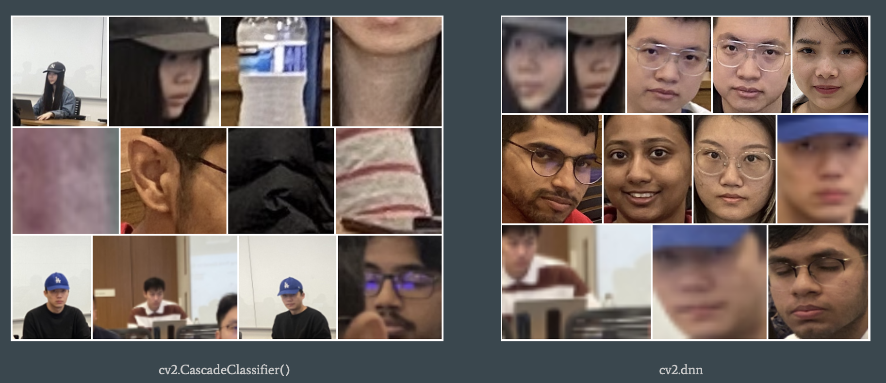

# Face Recognition for Smart Course Attendance System

## Introduction

This project is a part of the course **CSEN 240 Machine Learning** of Santa Clara University. The project aims to develop a light-weight model to recognize faces appear in the classroom. The two main problems model should solve are 1) design a lightweight model that can detect and recognize faces in real-time; 2) the model should be optimized for the classroom situation, which means it should be able to be trained with a small dataset and can recognize faces in a short distance.

For personal privacy, the dataset for training and evaluating will not be released. The presentation material, pre trained model, and the training code will be provided in the repository.

## Dataset

The problems in dataset are:

1. Irrelevant features in the dataset, such as other people's faces, bags, and laptops;
2. Different sizes/aspects ratio;
3. File names are all different;
4. Some files have different file format (e.g HEIC);
5. Minor data imbalance due to attendance;
6. Different photo angles;

In this project, I use the following methods to solve the problems:

1. Using python lib to convert every HEIC file to JPG or PNG;
2. Using python script to organize pictures' file names;
3. Using opencv to do data augmentation, such as rotation, flip, and crop;

## Process

For training and testing, I designed such processes:

1. Training

2. Testing

## Cropping Face from Picture

In order to recognice faces in the classroom, I need to crop faces from the pictures. I use two methods to crop faces: 1) using CascadeClassifier to detect faces; 2) using pretrained Dnn to detect faces. The second method's performance is better than the first one, so I use the second method to crop faces. Here is the comparison between two methods:

The workflow of cropping faces using pretrained Dnn is:

## Model

I trained two types of models: 1) traditional Machine Learning models; 2) Deep Learning models. For traditional ML models, I tried SVM, RF, and KNN models. For deep learning implementations, I tried using pretrained model ResNet.

I trained these models 20 epochs to learn features from the dataset while not overfitting.

## Results

| Model               | Validation | Testing |
| ------------------- | ---------- | ------- |
| SVM                 | 75%        | 61%     |
| KNN                 | 63%        | 52%     |
| RF                  | 72%        | 51%     |
| CNN                 | 89%        | 84%     |
| CNN based on ResNet | 94%        | 89%     |

## Acknowledge

I would like to thank my professor, Dr. Y.K. Chen, for his guidance and support throughout the course. I would also like to thank my classmates for their help and support during the course.